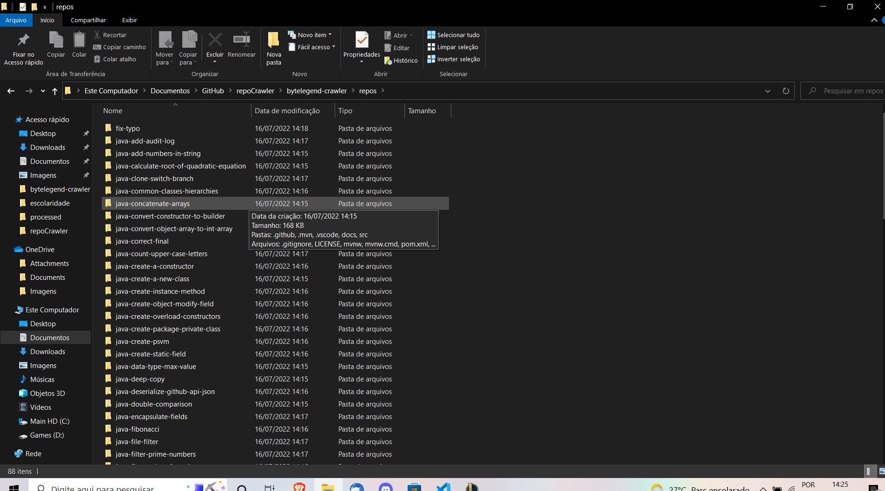

# RepoCrawler

Dependencies:
 - Python 3.10

How to use:

```
git clone https://github.com/Birlinha/repoCrawler
```

```
pip install selenium
||
python -m pip install selenium
```

```
cd bytelegend-crawler
```
```
python -m bytelegend-crawler
```
```
python -m importer
```

input: Go

output: data/bytelegend.csv containing https://github.com/orgs/ByteLegendQuest/repositories?type=all

